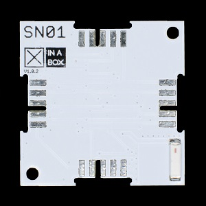

# ☒CHIP SN01

GNSS Module

This module can be purchased on [Xinabox CC](https://xinabox.cc/products/SN01/).

## Requirements
  - [☒Core Library](https://github.com/xinabox/xCore)
  - [Arduino IDE 1.8.1](https://www.arduino.cc/en/main/software)
  - ☒CHIP Core Modules
  
## Installation Guide
To install the libraries please follow the guide provided on the [Arduino Website](https://www.arduino.cc/en/Guide/Libraries) under "**Importing a .zip Library**".
